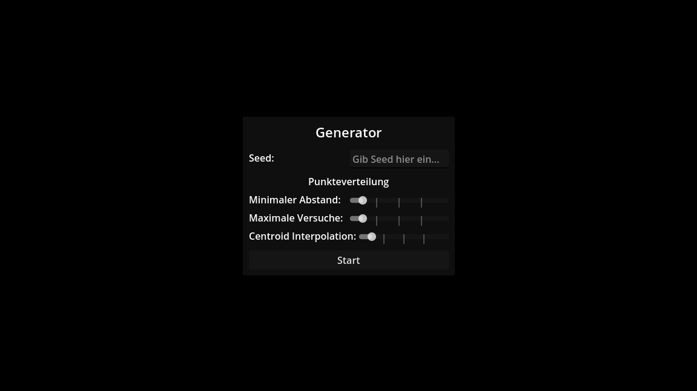
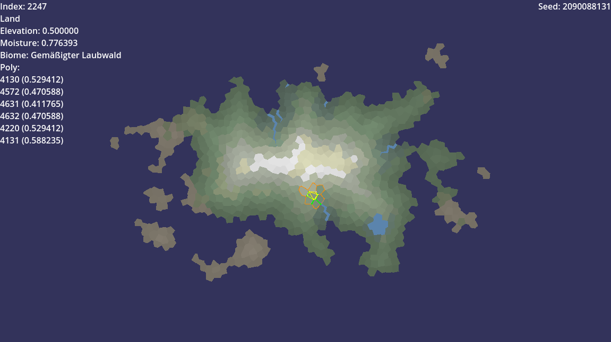

# Godot Map Generator

## Overview
This map generator roughly follows [this](http://www-cs-students.stanford.edu/~amitp/game-programming/polygon-map-generation/) article. I like to handle the voronoi cells as selectable regions, that is where this project is a bit different.

## Progress
### Currently implemented:
1. Polygons
2. Map representation (more or less)
3. Islands
4. Elevation
5. Rivers
6. Moisture
7. Biomes

### Todo:
8. Noisy edges
9. More noise
10. Smooth biome transitions
11. Distorted biome transitions

## GDExtension
It uses a custom GDExtension addon that provides a faster C++ implementation of Poisson-Disc-Sampling and a Delaunator. 
Originally used GDScript implementations, [this](https://github.com/hiulit/Delaunator-GDScript/blob/master/Delaunator.gd) for the 
Delaunator and a custom one for the PDS algorithm. The move to C++ improved the speed of the generator roughly by 50%-60%. 

The custom addon is located [here](https://github.com/Peatral/faster-geometry-2d-godot).

## Screenshots
The menu is fully translated in german and english.

A generated island. A selected cell is highlighted and information about that cell are displayed on the left or drawn directly over the island.

